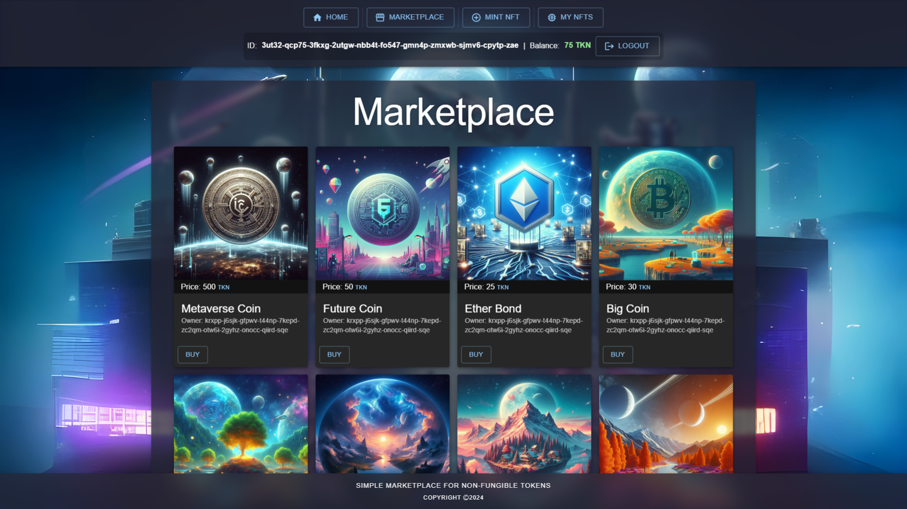

# IC_NFT_Marketplace

Simple NFT marketplace with Internet Identity authentication integration, where each minted NFT is created as a separate canister. Backend is written in Motoko, frontend is built using React/JSX and MUI (material UI).

<p align="center"></p>

## Prerequisites 

This example requires an installation of [IC SDK](https://internetcomputer.org/docs/current/developer-docs/setup/install/index.mdx) and [Node.js](https://nodejs.org/en/download/)

## Running the project locally

- To test project locally, open terminal window and navigate into the folder containing project's files
- Use the following commands:

```bash
# Installs necessary node modules
npm install

# Starts the local replica in background
dfx start --background --clean

# Deploys canisters to the replica and generates candid interface
dfx deploy

# Creates tokens and registers canister as its owner
dfx canister call IC_NFT_Marketplace_backend initTokens

# Starts a development server at  http://localhost:8080 proxying API requests to the replica at port 4943
npm start
```
